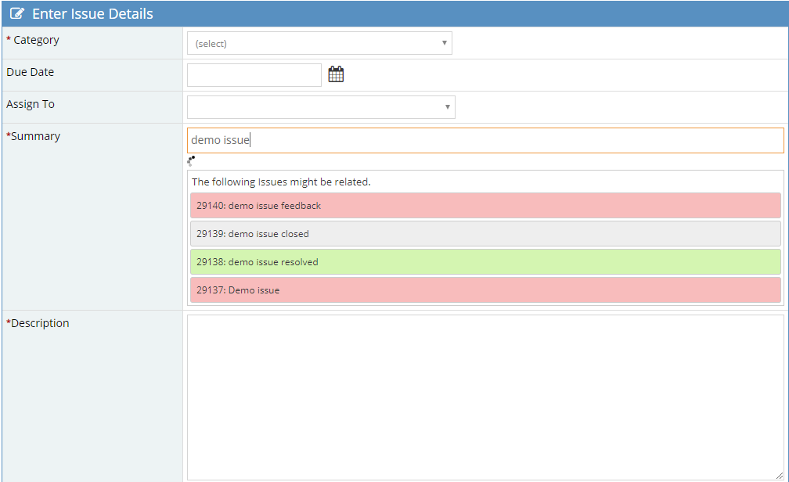

# MantisBT SearchRelatedIssue Plugin

Overview
--------
The plugin implements a live search for related issues during the creation of a new issue.

Screenshots
-----------

Download
--------
Please download the stable version.
(https://github.com/mantisbt-plugins/SearchRelatedIssue/releases/latest)

How to install
--------------

1. Copy SearchRelatedIssue folder into plugins folder.
2. Open Mantis with browser.
3. Log in as administrator.
4. Go to Manage -> Manage Plugins.
5. Find SearchRelatedIssue in the list.
6. Click Install.

Supported Versions
------------------

- MantisBT 2.0 and higher - supported
